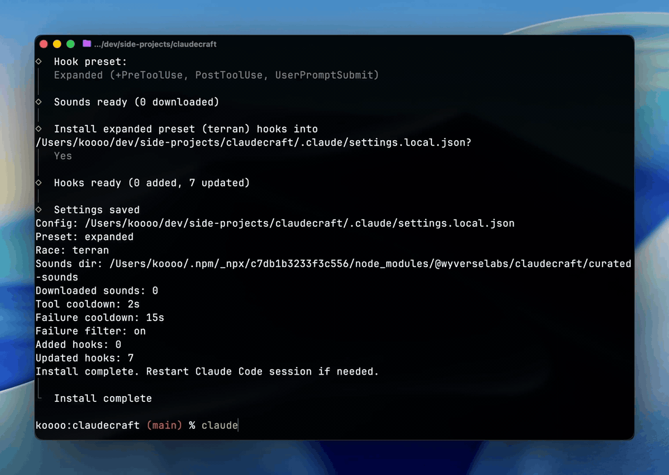

# AgentCraft

CLI to install StarCraft sound effects into Codex or Claude Code.
Interactive prompts are powered by Clack (`@clack/prompts`).

## Demo

[](assets/agentcraft-demo-short.mp4)

[Download demo video (MP4)](assets/agentcraft-demo-short.mp4)

## Run with npx

```bash
npx @wyverselabs/agentcraft
```

Examples:

```bash
npx @wyverselabs/agentcraft install --agent codex --scope project --race random
npx @wyverselabs/agentcraft install --agent claude --scope project --preset expanded --race random
npx @wyverselabs/agentcraft doctor --agent codex --scope project
```

## Local development

```bash
bun install
bun run build
node dist/cli.js install --scope project --preset expanded --race random
node dist/cli.js game --ui phaser --open
bun run dev:game
bun run dev:game:starcraft-local
bun run dev:game:hmr
bun run dev:game:starcraft-local:hmr
bun run dev:game:watch
bun run dev:game:starcraft-local:watch
```

`dev:game` is now the default HMR flow: Vite dev server (`http://127.0.0.1:5173`) + local game backend (`http://127.0.0.1:4320`) with proxy for `/api`, `/game-assets`, `/runtime-config.json`.
`dev:game:watch` keeps the old build-watch flow (no true HMR, default dev port: `4318`).
Set `AGENTCRAFT_GAME_API_ORIGIN` to change the proxy target if needed.

## Commands

### Install StarCraft sounds

```bash
npx @wyverselabs/agentcraft install
npx @wyverselabs/agentcraft install --agent codex --scope project --race protoss --yes
npx @wyverselabs/agentcraft install --agent claude --scope project --preset expanded --race protoss --tool-cooldown 2 --yes
```

### Fully interactive mode

```bash
npx @wyverselabs/agentcraft
```

Interactive menu labels are outcome-focused (for example, `Install StarCraft sounds`).

### Switch race/settings (no reinstall)

```bash
npx @wyverselabs/agentcraft switch --agent codex --race random
npx @wyverselabs/agentcraft switch --agent claude --race zerg
```

### Uninstall hooks

```bash
npx @wyverselabs/agentcraft uninstall --agent codex --scope global --yes
npx @wyverselabs/agentcraft uninstall --agent claude
```

### Doctor

```bash
npx @wyverselabs/agentcraft doctor --agent codex --json
npx @wyverselabs/agentcraft doctor --agent claude
```

### Game mode (RTS dashboard)

```bash
npx @wyverselabs/agentcraft game watch --agent codex --open --idle-threshold 20
npx @wyverselabs/agentcraft game --agent codex --asset-pack open-rts --open
npx @wyverselabs/agentcraft game status --agent codex
npx @wyverselabs/agentcraft game --agent claude --open
npx @wyverselabs/agentcraft game --agent claude --theme zerg --open
npx @wyverselabs/agentcraft game --agent claude --ui legacy
npx @wyverselabs/agentcraft game reset --agent claude --yes
npx @wyverselabs/agentcraft game assets install --pack kenney-rts
npx @wyverselabs/agentcraft game assets doctor
```

### Import StarCraft-clone local assets

```bash
# 1) clone source repo once
git clone https://github.com/raydogg779/StarCraft assets/external/StarCraft

# 2) build local pack images (requires Pillow)
python3 -m pip install pillow
bun run assets:import:starcraft-clone

# 3) point agentcraft game to that generated pack
bun run assets:install:starcraft-local

# 4) run game with that pack
bun run dev:game:starcraft-local
```

### Run tests

```bash
bun test
bun run typecheck
bun run build:game-ui
```

### Rebuild tool sound pools (maintainers)

```bash
bun run curate:tool-sounds
```

## Notes

- Codex project scope writes `.codex/config.toml` in the selected project.
- Codex global scope writes `~/.codex/config.toml`.
- Codex native hook entries are stored in sibling `.codex/hooks.json` (or `~/.codex/hooks.json` for global scope).
- AgentCraft enables `features.codex_hooks = true` when installing Codex `SessionStart`/`Stop` sounds.
- Codex installs `SessionStart`, `Stop`, and `agent-turn-complete -> Notification`.
- Claude project scope writes `.claude/settings.local.json` in the selected project.
- Claude global scope writes `~/.claude/settings.json`.
- `--race` supports `protoss`, `terran`, `zerg`, `random`.
- `PostToolUseFailure` hook is installed in expanded mode (`Bash` matcher).
- Tool sounds (`PreToolUse`, `PostToolUse`) use a 2s cooldown by default (override with `--tool-cooldown`).
- Failure alerts use a 15s cooldown by default (override with `--failure-cooldown`).
- Failure noise filtering is on by default (disable with `--no-failure-filter`).
- `PreToolUse` and `PostToolUse` use race-specific sound pools for variety.
- `agentcraft game` launches a local browser dashboard with mining/production state.
- Default game UI is Phaser (`--ui phaser`); fallback inline mode is available via `--ui legacy` or `--legacy-ui`.
- Phaser mode uses a 4:3 gameplay canvas with responsive framing and supports `--theme auto|terran|protoss|zerg`.
- You can override asset pack at runtime with `--asset-pack kenney-rts|open-rts|placeholder|starcraft-local`.
- Dashboard renders animated worker shuttles (SCV/Probe/Drone flavor) between minerals and base.
- The game runtime is local-only (`127.0.0.1`) and does not require hosted backend infrastructure.
- Game visuals default to bundled open-license `kenney-rts` assets (Kenney CC0) with StarCraft-inspired layout/composition.
- Optional bundled `open-rts` pack is still available for the previous vector style.
- Users can switch to generated fallback assets (`--pack placeholder`) or local custom files (`--pack starcraft-local --assets-dir <dir>`).
- Image asset reference source (GitHub): https://github.com/raydogg779/StarCraft (local import workflow only; do not redistribute without confirming rights)
- `all-sounds/` is source/reference; active packaged sounds are copied into `curated-sounds/`.
- Sound reference source (YouTube): https://www.youtube.com/watch?v=9HjQ-qHTn28
- Sounds are auto-downloaded from GitHub on install when not present locally.
- You can override with `--sounds-dir /absolute/path/to/curated-sounds`.
- Existing non-AgentCraft hooks are preserved.
- Managed entries are tagged for safe uninstall.
